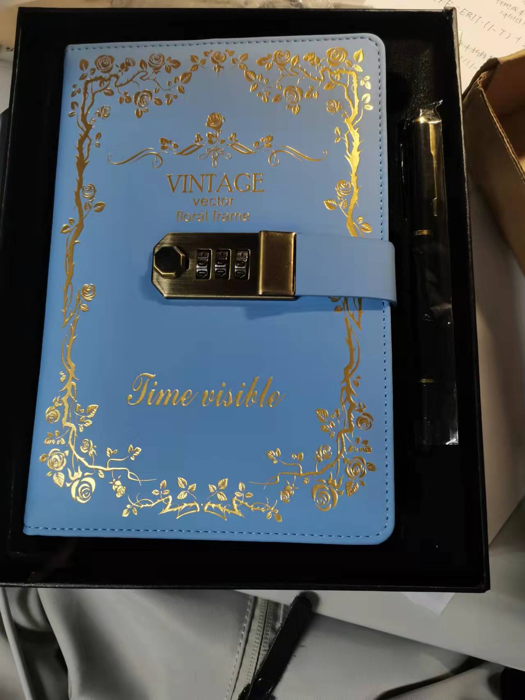

>Always summer

2022年8月5日 星期五

&emsp;&emsp;以为今晚有课发现今晚的课又被调到了明晚，好烦，这种调课能不能提前通知啊。

&emsp;&emsp;2/5，胜利在望

&emsp;&emsp;虽然昨晚的事情被膈应到了，但是想想不值得为这种人费心费神。

&emsp;&emsp;看到大家都有书读怎么可能内心没触动呢？好在我在大一就料想要考研，所以对我来说也不怎么难接受。可正如哼哼怪所说，下学期我们考研的人夹在保研了的人之间日子可能有点难过。去年看到那些保研的师兄师姐大四是愈发潇洒悠闲，而临近十二月，图书馆藏书馆的座位也是越来越难抢。对比之下心态是最难平衡的吧。

&emsp;&emsp;和我不熟才会来问我参没参加夏令营。尽管这是实话，但听起来我确实不高兴。像是在说熟人知道我这成绩压根不会参加夏令营。虽然可能实际想说的是熟人知道我的规划安排。有个朋友问过我，你是不是因为成绩不好有点自卑啊？我说是的。其实我还很敏感别人说我的成绩不好，间接也不行。别人晒自己的绩点多高我不会有什么触动，但拜托不要提到我好吗？长得不高会自卑，不好看会自卑，不会穿衣打扮会自卑，身材不好会自卑，没有耀眼的实习会自卑，成绩不好会自卑，让人自卑的事情实在太多了。外貌身材方面我可以接受，但学业方面关系前途我真的很难受😭

&emsp;&emsp;回想起总是被鞭策的成长历程，你要努力，你要听话，如果你做不到xxx就xxx了，你没尽力你还可以做得更好。除却外界我自己也在施压，像是进入某个赛道就必须不断奔跑，不敢想落后会怎么样，也就逼着自己一直向前。第一次考科目二时，所有人都在盼望我一次通过，除了我自己知道肯定不行，后来果不其然很快就挂了，打破他们的期待后竟然莫名其妙感到轻松，甚至得意，这是我久违的叛逆。也许所有外界的压力都通过自身再作用于内心，扪心自问我敢躺平吗？我不敢，没有这种底气。

---

2022年7月29日 星期五

&emsp;&emsp;昨天参加了聚会，喝奶茶，吃火锅，唱K。本人五音不全居然也成为麦霸，因为自己出了所有KTV的钱，自己不唱实在很亏。但是聚会很明显消耗我的体力和能量，坐车也让我头晕想吐，今早更是睡到了十点多，今天也是懒懒的不爱说话，需要独处一段时间来恢复能量。

&emsp;&emsp;明天要上英语写作的课，今天中午梳理了一下前几节课的PPT，做了笔记，写完了上节课的作业。DDL总是拖到最后一天。英语写作梳理笔记还是很有用的，现在脑子里有了框架和对应的模板，不会在写作文时写得太散。中午真的是很适合学习英语的时间段，不太烧脑，有点困也无妨。只是希望不要把英语和困联系在一起，这可就大事不好了。

---

2022年7月26日 星期二

&emsp;&emsp;今天是摆烂的一天，学习上只背了单词，练了会儿字。业余生活倒是很丰富。下午编了个小雏菊手链，傍晚去散了个步，晚上做酱牛肉。今天在b站上待了很久，我忏悔，我有罪。

&emsp;&emsp;下午时不想出门，就让妹妹去一个商店帮我拿在美团买菜上预定的牛肉和大葱。没想到妹妹只带了个葱回来，她说今天这家店的老板娘不在，换了一个大叔。大叔不搭理她，问他话就说我怎么知道呢？我从来不管这事。她问了大叔好几遍话都不理，于是她就回来了。我听了自然是疑惑，这个帮忙看店的人是不想做生意了？但我同时也疑惑为啥妹妹不打电话给我，而是就这样回来了。

&emsp;&emsp;我立即套上防晒服和帽子，又和妹妹出了门。去的途中我就开始给自提点的商店打电话，不客气的问他为什么看店的人态度那么差，拿东西还要摆脸色。老板娘说这个人耳背听不见，耳背我还有啥指望的呢？但是我的东西必须要拿到。我是坐在电动车后座上打电话的，我说移动电话就要移动着打才有感觉。（出自学校一位有趣的老师）

&emsp;&emsp;到了商店我就去冰柜前看，但没看出有牛肉的样子，都是冰淇淋啥的。我以为还有别的冰柜，我就问这个看店的人冰柜在哪儿，他说你要买面粉？我手一挥，不跟你说了，我自己找吧。最后我自己找到了牛肉，就拿走了。这个一直刷短视频的大爷终于站起身，说我没付钱，我说我美团买菜上买的，他说你从冰柜里买的没付钱啊！我打电话给老板娘说你跟看店的人解释吧，他说我没付钱。然后我就走了，回去的路上觉得刚刚吵架发挥失常，他说你没付钱我就应该说那你报警吧，气死他。

&emsp;&emsp;回家后我发现妹妹幼小的心灵受到了冲击，她说她还是太弱了，，，老妹儿过于善良老实，还很有礼貌。上次去拿订好的蛋糕，我们没有带付款时开的单据，老妹儿用普通话解释，我们前天在这里订了个蛋糕，今天傍晚五点拿，但是呢我们忘了带单据……我当时就很疑惑，直接说我订了个蛋糕，约好五点拿不就行了。他要问单据的事另说，要单据就是没有，反正我钱也给过了，还能不给我不成？我的需求就是拿蛋糕，其它的手续上的瑕疵另说。表达尽可能简单直接，达成目的为先。

&emsp;&emsp;今天我问老妹儿，你没找到牛肉，就拿了个大葱回来啦！咋都不打电话给我。她说她被那个看店大爷气糊涂了，忘了还能打电话给我这件事。我说那你没拿到准备咋办，她说那我就待会儿再去呗，晚上再去呗，我不信晚上老板娘还没回来。我说假如我是你领导，让你拿东西你没拿到，你也会等会儿才去吗？她说啥领导让人跑腿啊，那我就不干了。

&emsp;&emsp;俺曾经也觉得以礼待人大家和和气气的多好，但有些人就是看人下菜碟，所以现在皮厚的我选择有事说事，直达需求，利益优先，不爽就骂。我的需要要得到解决，不管要用什么方法。

---
2022年7月25日  星期一

&emsp;&emsp;今天发现昨晚忽略了一个朋友发的微信消息，我还纳闷她咋在别的平台大倒苦水。她对抗悲伤的方式是火锅和奶茶，如果是我的话，由于待在这偏远小镇，大半夜没有火锅和奶茶，可能选择去看日出吧。

&emsp;&emsp;其实安慰别人显得很虚旷，何况是过期安慰，除非你比要安慰的人还要惨。然而我确实更惨，我从大一第一学期绩点崩盘就知道别想保研了，也就不再卷实习卷学生工作卷志愿时数，选了一些自己喜欢的课，浑浑噩噩过了三年，然后被现实逼到书桌前学习准备考研。出国是别想了的，考公也没兴趣，何况我连党员都不是。如果考不上研是什么结果呢？我不敢想，专业学的不怎么样，也没有考证，一段对口实习也没有，出去混都很困难，现在经济也不景气。饶是如此，我仍然安慰我的朋友，我们都会有学上的！

&emsp;&emsp;SPSS基础拿了满绩，另一门公共计算机课信息技术基础也是满绩。其实我的计算机水平不怎么样，却在这里有了意外惊喜。有什么是我学的好的课程呢？还真想不出来，那我得庆幸还好有几门满绩的课给我安慰。但是谁又说只有分数高才能有成就感呢？

&emsp;&emsp;打印资料花了好多钱，一页纸居然要五毛钱，一页纸啊不是一张纸，学校里只用两毛钱，走出校门，社会教我做人。

---

2022年7月21日  星期四

&emsp;&emsp;有进步啊！离上次写日常只隔了三星期！混混沌沌的七月就这样过了2/3。因为一些个人原因疯狂刷过小红书一段时间，获取相关知识，在得到确凿结果后便停止了这种行为，也许人在什么都做不了只有等待时就会这样，等待让人难以忍受。

&emsp;&emsp;尽管知道在过去的那个时点，他人做出的选择是无法更改的，甚至是那时最好的选择，可细想起来仍然觉得难过。痛苦在比较中产生，幸好我也长大了，受到的影响越来越少，尽管有些东西是永远逝去了。

&emsp;&emsp;睁眼是八点的闹钟，关掉再睡，醒来就是九点半，美宝啊美宝，你何时能够早起！

---
2022年6月30日 星期四

&emsp;&emsp;日记——周记——月记，离谱啊离谱。似乎日子过得一般般时感觉无事可记，日子过得太舒畅也就想不起来记事。这么说之前天天记是因为过得不开心？那倒也不是。我只不过为自己偷懒找个借口哈😁

&emsp;&emsp;从上次记日记到现在发生了一些事。主要是期末、旅游、cousin  party。

&emsp;&emsp;期末嘛，没啥好讲的，写写写，编编编。我的拖延症愈发严重，逃避虽可耻但无用。朋友说的有道理，一天写个两千字好了。一想到五千字就觉得连开始都困难，但想到两千字觉得只是小意思而已。所以难做的事情一定要开始做啊！

&emsp;&emsp;然后是一周的旅游，玩的很开心，吃的也很开心，但是蚊子太多了，天太热了。蚊子咬的包包现在还没消完，可恶😣

&emsp;&emsp;cousin party，我喜欢！起因是堂哥在群里说要不要来个烧烤聚会，大家说好啊好啊。可是我不想他带他儿子来，担心会变成大家帮他看小孩儿，那谁来陪我玩呢？不开心。而且除了堂哥和他儿，其他都是姐妹，他一个已婚已育老男人和我们有啥好玩的呢？由此我开始煽动其他表姐妹组小队玩。26号那天我临时起意和表姐妹看电影。看了《人生大事》，感觉还不错。就是这四川方言咋和我们方言很像呢？表姐说这片子其实是在武汉拍的，可能武汉方言和我们的有点像，有点道理。

&emsp;&emsp;看完电影吃了烤肉。滋滋滋，好香好香。tt真好，一直帮我们烤肉和夹菜。她说她咋和谁吃烤肉都是干活那个，之前和三个男生吃她也是负责烤肉那个。我听了大惊！怎么可以和三个男生一起吃饭！男生吃的多又不帮忙烤肉，付钱时再AA，你吃亏了呀！吃完饭还打包了一盒烤肉蘸料干粉，可惜第二天落在yy家了。

&emsp;&emsp;其实那天聚会前我就想到一个蛮严重的问题，吃完咋回家呢？市区离家里有十多公里，吃完饭九点了，公交没有，出租感觉不太安全，妈妈又不敢夜间开车，但是当时决定不想这个问题，现在吃完饭了，倒是不得不思考这个问题了。我们一合计，决定在酒店住一晚，第二天再回家。

&emsp;&emsp;于是分头打电话，妈妈自然是担心啦！她说她去找个司机接我们好不好，我们说不好。这么晚了还是不要麻烦别人了，住一晚第二天回家好了。打电话给姑姑她的第一个问题是，怎么洗澡呢？喔，我们完全没有考虑到洗澡的问题，洗澡对我们来说也不是什么重要的问题。于是我们就去住酒店啦！

&emsp;&emsp;查了一下格林豪泰酒店，一家满房，一家距离四公里，倒是还有空位。表姐先带我妹走了，我和yy步行前往，高德说走一小时就行。期间我们还走错了路，理应上桥但没有上桥，在桥下走了许久看到前面是断头路无奈折返。tt那波导航到了那家已经满房的格林豪泰，所以和我们的路线都不一样，最后路过一个格丽酒店，美团上看也没满房，我们就决定住这里。

&emsp;&emsp;四个人只有一个人带了身份证，幸好还有一个人带了身份证。进了房间感觉房间真的好大，毫不夸张的说，是我住过的标间里最大的。空间大到四人可以一起跳刘耕宏。镜子上有个触摸按键，点一下镜子周边会打光。还有贵妃榻，巴适！还送两人早餐，一晚122块，值啊值啊。

&emsp;&emsp;我和yy还从前台借了两本书，我们都只看了第一页，然后就搁置。我借的是加缪的《局外人》之前看了没看完，以后得找个机会看完。

&emsp;&emsp;关灯后yy仍精力旺盛的听歌玩手机，其余人打算入睡，虽然我没入睡成功。早上醒来tt已经上班去了，其余妹妹都还在睡。tt像宠幸完三个妃子却还要上早朝的勤政皇帝，留恋不舍却只能先走，三个贪图享受的妃子醒来接近九点，酒店早餐供应到九点，她们俩起身去薅了一波早餐，回来时还给我带了一个茶叶蛋。

&emsp;&emsp;在离开酒店前，我们造作地摆拍了一番，拍的图片多到yy晚上还在修图后期。我们本来打算去吃自助餐，到了地点后转向了肯德基。我当然会点我最爱的土豆泥，小小一盒7.5，钱包捂眼痛哭。吃完饭我顺便去配了一副眼镜，选的镜框和上一副差不多，可能年纪大了，审美确定了。度数也没怎么涨，换掉眼镜是因为上一副已经用了三年，镜框和镜片都磨损严重，所以就换掉了。

&emsp;&emsp;原本我打算上午配眼镜，下午做头发，结果上午没起来，下午才去做了头发，晚上看电影，吃烤肉，第二天中午去配了眼镜，回家一点多，在一天内完成了任务，勉勉强强吧。

&emsp;&emsp;话说堂哥仍然想办烧烤聚会，而且想在我家门口，可我家门口有一堆土，腾不出地方。而且我实在不想他带着儿子来聚会呀！咱们就来个cousin party姐妹版好了。

---

2022年5月23日 星期一

&emsp;&emsp;经历了一波三折后我终于还是run回了家。由于户口迁走了两边居委会都查不到我名字，他们也就都不管我，我甚至没有被要求居家隔离，只是被叮嘱少出门。可就算我出门，也没有人认得出来我。但我懒洋洋地目前还没出过门。

&emsp;&emsp;今天高级会计学老师说开卷考试不现实，闭卷也不合适，申请了论文结课，可把我高兴坏了。高级会计学是我这学期最担心的一门课，如果老师闭卷考试，我几乎是要在近几周自学一遍，为此我还买了习题册。如果改成论文我的压力会小很多。

&emsp;&emsp;今天意外地被老师夸奖了，甚至是，好几次。审计学老师点人回答问题点到我，我也就开麦说了两句，老师居然说我回答的很好。今晚论证有效性分析的老师也夸了我两回，称呼我为周同学🤣在学习上我一直没啥自信，不论是大学课程还是考研，今天居然收获了小小惊喜。

&emsp;&emsp;痴迷于比较各种烤箱，中午因此都没午睡。倒是有心动选手，但是想蹲一波618的优惠，希望届时商家不要卖的比现在还贵，等等怪会不会胜利呢？

&emsp;&emsp;艳羡一位朋友的自信，我经常处在自我怀疑当中。现在只要是考上研（学校还行）的我都羡慕。之前微博上有位博主被群嘲，我的关注点在于可是她考上985的研究生了哎！我真是魔怔了。

---

2022年5月8日 星期天

&emsp;&emsp;买了两套JK，然而我的气质难以被掩盖，穿上玛丽珍鞋依然会颠脚，配上JK像个不良少女🤣

&emsp;&emsp;在非理性领域，我相信奇迹。

---

2022年5月2日 星期天

&emsp;&emsp;这可是劳动节哎，以及春假，连在一起我有十天假期。但是因为疫情又不能出京，别说出京，去个超市都要48h内核酸。这日子没法过了。

&emsp;&emsp;昨天试了一套水手服，感觉还不错，虽然裙子没拆线前我穿的像个灯笼，拆了线后我扭来扭去又像跳夏威夷草裙舞😁为了配水手服我又下单了皮鞋和长筒袜，咱就是说改变穿衣风格好费钱的啊😭已经开始期待另一套蓝色水手服了。

&emsp;&emsp;西瓜王子很好吃，被开膛剖肚，挖出心脏，榨干鲜血，抛尸垃圾桶🤪

---

2022年4月15日星期五

&emsp;&emsp;今日头痛，非午睡和风油精能有效缓解，晚上去跑步，希望有用。

&emsp;&emsp;报名参加了下周五的编绳活动，因为看成品很像unravel1里的通关成就，我很喜欢这个游戏

---

2022年4月11日星期一

&emsp;&emsp;论文写作课终于结束了，持续了半学期的噩梦。到结课发现况老师居然还有点可爱，虽然他上课真的很恐怖，超多提问，要求很严，每次上课前我都在背上节课的内容，尝试把它们记下来。老师应该也知道我们在临时抱佛脚，但是聊胜于无。

&emsp;&emsp;今天北京的风好大，飘了很多柳絮，团成团滚在地上，无孔不入甚至钻进口罩里。

&emsp;&emsp;头有点痛，多喝热水。

---

2022.04.07.星期四

&emsp;&emsp;辛辛苦苦倒腾了这么久数据没一个显著，我还是赶紧换主题吧天哪我恨不显著。

&emsp;&emsp;这世间哪有那么多因果，可连相关你都不给我！

&emsp;&emsp;绝望，真的绝望，为什么，换了一个要做面板数据，面板数据是我能染指的吗，啊啊啊

---

2022年4月6日 星期三

&emsp;&emsp;好像我考不上研一切美好的事物都会离我远去，人生将堕入黑暗。虽然我反反复复告诉自己考不上就考不上，考研没那么重要，但是我也知道考不上会有什么后果，一些不太好的事情发生的概率会加大，一些美好的事情发生的概率会缩小。我感到痛苦的原因是我不知道自己能不能考得上，不知道是什么水平的人同我竞争，我自己是什么水平我也不知道，我也不知道做什么能考得上，一切像个黑箱子一样。而且还有8个多月的时间，等待是漫长的，而不知道自己的水平如何让人觉得8个多月又太短。或许我太追求结果，想减肥就想立刻看到体重下降，想考上研巴不得立刻收到录取通知书，想赚钱希望存款余额立即多出几个0，哪有这么好的事。甚至即便我尝试了自己认为的所有方法依然没有收获自己想要的结果，那我也只能安慰自己尽人事听天命了。

&emsp;&emsp;可以感受到一位朋友小心的试探，现下规划不同，多说恐多虑。这份心情也许同我当初那份惆怅一样吧。

---

2022.03.30星期三

&emsp;&emsp;美宝也是宝贝啊

&emsp;&emsp;好多考研的师兄师姐出了复试结果了，当然发出来的都是上岸的。真希望明年我也能上岸。怎么什么都用上岸，打hpv也是，考研也是，考公也是，中国人一半都泡在长江黄河里嘛

---

2022年3月28日 星期一

&emsp;&emsp;已经敏感至此了吗？还是说已经无法客观判断了。

&emsp;&emsp;又又又没抢上六级，，，抢不上就抢不上吧，毕竟考过了，但是分有点低，想督促自己好好学英语

---

2022年3月26日 星期六

&emsp;&emsp;感到被冒犯，，，

---

2022年3月24日 星期四

&emsp;&emsp;发现自己有沉迷unravel的危险。我的技术似乎比以前有所长进，又或者是我的心态更放松了。表现为不再紧紧按住键盘，即使卡关也不会气急败坏。后果就是我还想接着玩这个游戏。

&emsp;&emsp;最近东航MU5735成为了焦点，查看了一下携程订单，哦豁，我也坐过东航的航班，从广州出发，机型也是737😂这个机型是很常见的机型吧，但是意外来的太突然了。

&emsp;&emsp;人们关于飞机失事原因的探究没有停止，但除此之外，飞机上的人们的身份过往也被媒体争相报道。但我觉得媒体应该在受访者已知自己认识的人是这架飞机上的乘客的情况下再去邀请采访，第一告知情况的人不该是媒体。这些人都是普通人，都在努力的生活。疫情当下，突闻噩耗，更让人觉得世事无常。

&emsp;&emsp;今天得知家那边有人确诊的，从上海回来的，公交已经停运了，我被疫情偷了家。🙄

&emsp;&emsp;我该如何消除困顿，每日起床的昏沉，拖拽着人。

---

2022年3月13日 星期天

&emsp;&emsp;昨天刻了个章，今天也刻了个章，比较一下还是觉得昨天冲刀法刻的好。有个朋友以为这是“色”字，哈哈哈细看倒真有点像，色字头上一把刀。

&emsp;&emsp;这几天居然又有点冷，倒春寒，想翻出那件印着华妃娘娘的卫衣却怎么也找不到，找到一件加绒衬衫也就将就穿了。

&emsp;&emsp;这周五离职，出去大吃一顿，不过这家羊蝎子不是很好，感觉有点被宰。下周开始就有更多时间了，估计我就是天天泡图书馆吧。

---

2022年3月5日 星期六 惊蛰

&emsp;&emsp;我这日常大概可改名叫周常吧，一周写一回。因为周末我总待在藏书馆，可以随心写写画画，待在宿舍我是没法写作的。

&emsp;&emsp;口腔溃疡三四天总不见好，碘含片在嘴里化了又含，溃疡仍在，就出东门买药去。意外看见了门外的建筑，青色玻璃映出另一栋楼，和身边的橙白相间的楼并肩站立，天空有鸟飞过，有幸拍到一只。好久没有在博客里放图片了，一来觉得麻烦，二来怕养成惰性，只拍图不解释，在我心中文字是远胜于图片的。

&emsp;&emsp;昨天让部门领导在我的实习证明上签字，领导和我聊了聊。提到年轻人要主动，主动去思考去做事，这是为了自身的成长，为了达到一个higher level。不是说一天就给两百块钱，多了的事我不干，除非加钱。她希望实习生离开的时候从这里也能带走一些啥，有所收获。

&emsp;&emsp;其实一天工资还没有200块，我的收获是早下班早省事，不要无意义滞留工位，以及以后绝不干人力。

&emsp;&emsp;我习惯吃完晚饭在校园里晃悠晃悠，这大好春光，难得晴日，微风舒畅，我为没有春游而伤感。朱子辉老师曾在上课期间说，“肯将千金轻一笑。你们为了功名在这春天来听我讲课，而不是去陪女朋友赏花游春，庸俗！”老师与我同乡，又是性情之人，着实可爱。

&emsp;&emsp;今天惊蛰，又是一个节气呢。中午遇到哼哼怪一起吃饭，拿完快递后就知道今天中午是没法午睡了。又在静园水果店门口领了数字人民币的券，也就顺带着办了一张建行的信用卡，一通折腾已经近两点了，干脆返回藏书馆。不过我用数字人民币优惠券买了菠萝和菠萝蜜，也不枉花费我诸多时间。

&emsp;&emsp;近来为琐事忧虑，不平甚至愤恨，当下虽然还未解开，但因为忙于眼前之事反而少了些胡思乱想的时间。人生不是罐子，装了快乐装了悲伤，人生是导管，流过快乐流过悲伤。我很喜欢这个说法，生命既然是流动的，来来往往世事无常，那就随它去吧。

---

2022年2月27日 星期天

&emsp;&emsp;距离上次写日常居然已经是一周前了。

&emsp;&emsp;买了篆刻需要的材料，这学期的篆刻学是最期待的课。我已经预料到将在这门课上花费很多时间，甚至手指也会受伤。似乎每学期我都会选一些奇奇怪怪的课，大多是公共艺术类。然而自己在艺术上并没有什么天赋，说不定呢，或许有尚未展现的天赋。

&emsp;&emsp;决定今日改“秋毫”为“春华”，一个俗气的不行的名字，好迎接春天。

&emsp;&emsp;晚间走在路上都不用戴围巾帽子，衣服也渐薄，尽管花粉对我来说意味着灾难，但还是喜欢春天吖

----

2022年2月20日 星期天

&emsp;&emsp;今天是难得的晴朗日子，也是开学前一天。我的朋友圈里，大一的，大三的，硕士生，博士生，都在哀嚎不想开学，学生们形成惊人的一致。我这学期只有周一周二有课，周三、四、五去实习，周六周日休息，安排的正好，半工半读的大学生。

&emsp;&emsp;室友们也陆陆续续的回来，寝室又开始热闹起来了。

---

2022年2月19日 星期六

&emsp;&emsp;很久没记录过日常了。今天做了可乐鸡翅，哼哼怪做了西红柿炒菜花，我们还煮了米饭，美美吃了一顿午晚餐，只不过我和她都没吃饱……

&emsp;&emsp;吃完看了四集甄嬛传，啊，十年了还是逃不过甄嬛传，现在正看到甄嬛御花园遇到了皇上，爱情开始的地方。当我再看甄嬛传时，能联想起一些伏笔和照应，和一些人生感悟，和十年前我看甄嬛传心境大不一样了。

&emsp;&emsp;看完甄嬛传去做了帕梅拉，本来是准备去游泳的，但是腰突然抻到了，不敢再去游泳，背上瑜伽垫去楼道里做帕梅拉，开学人多了起来，楼道里也有人进进出出，私心觉得还是人少一点好，电梯不用等，图书馆都是座位，路上人也稀少。

&emsp;&emsp;这样好的日子，开学就享受不到了！

---

2022年1月5日 星期四

&emsp;：一般难度

货币资金（应收票据、应付票据的商业汇票，应收票据可贴现，商业承兑或银行承兑）;

存货实际成本核算、委托加工物资（收回立即出售计入成本，继续深加工可以抵税）、包装物、低值易耗品、存货清查（待处理财产损益）;

短期借款;

应付款项;

其他应付款;

长期借款;

长期应付款;

成本费用

：中等难度

存货计划成本核算（是企业内部核算、准则要求实际成本、材料采购-借方是实际成本，结转入库成本差异借方是超支-贷方是节约，发出-计划成本，分配发出材料差异，料到单未到等、

跌价准备计提;

固定资产（专项准备和预计负债，未来环境费用今天要资本化出来）（单独作价的土地，超额使用资产）资本化（未来经济利益发生了变化、费用化，处置要通过固定资产清理;

无形资产（没有结算科目）;

投资性房地产（成本模式、公允价值计量模式、转换-投资转非投，公允价值更高的时候差额计入OCR;

应交税费（增值税是重点、进项税销项税-应纳税、不允许抵扣的要转出、小规模纳税人;

应付职工薪酬（设定提存计划、收益计划，OCR不能转入当期损益，数额不能确定，辞退福利计入管理费用，发非现金商品视同销售）;

或有事项（不用做账时披露，做账的是预计负债，预计负债条件，借营业外支出、管理费用、销售费用 贷预计负债）;

所有者权益（负债和权益工具划分，优先股和永续债）;

利润及其分配（本年利润、利润分配，现金股利和股票股利-投资方和被投资方）;

财务报告编制与分析;

会计估计变更;

会计差错更正（前期重要差错

增值税和税金及附加没有关系，所得税单独有账户，印花税和耕地占用税不通过应交税费

其他权益工具投资不能进损益（因为是指定的）应付职工薪酬中的损益不能进，权益法；投资性房地产OCR进其他应付成本，金融性资产进入……

所有者权益：股本、其他权益工具、未分配利润、盈余公积

库存股（所有者权益的抵减科目）、专项准备

资产列报的都是净值，预付和应付要分开列报，未确认融资费用——长期应付款抵减，未实现融资收益——长期应收款抵减

利润表上营业利润、营业总和、综合收益等四段

较高难度

基本会计理论（可能是问答题，答要点）;

金融资产（三分类，业务模式、现金流量特征，通过现金流量测试的一定是债权，债权投资，摊余成本，期末摊余成本等于期初摊余成本+投资收益（财务费用）-现金流入（现金流出）这期期末是下一期的期初，买价中已宣告未发的利息是应收利息，交易费用在利息调整 债权分期付款 一次还本付息，;

长期股权投资;

应付债券;

可转换公司债券;

借款费用;

其他综合收益;

收入;

资产负债表日后事项;

会计政策变更

摊余成本：债权投资、应付债券、固定资产（超过正常信用期购买，未确认融资费用

其他权益工具投资-指定，公允价值到OCR，不影响利润，

预期信用减值，借：信用减值损失 贷：OCR

长期股权投资，非合并 同一控制-不符合市场原理 非同一控制-对价，合并-对子公司，交易费用都计入管理，非合并形成的交易费用计入入账价值；成本法、 个别报表用权益法 权益法

公允价值调整、内部交易调整

可转债-分拆涉及其他权益工具-资本公积-股本溢价是倒挤出来的

借款费用-分年度-年下分专门借款和一般借款- 专门借款资本化减去闲置资产的投资收益 一般借款先资本化-累计支出的加权平均数

收入-五步法 交易价格：可变对价、三年未收回  时点确认-失去控制权  合同资产-履约风险  合同成本-合同履约成本（运杂费）、合同取得成本（佣金）两个都是资产账户  

 特殊交易：负退回条件的销售、预计负债、应收退货成本  委托代销 售后回购 客户额外选择权的销售（单独业务、合同负债

期后事项：税前-所得税-税后三阶段 换账户 应交所得税-递延所得税 利润分配只考虑盈余公积  以前年度损益调整

会计基本理论、六个要素、资产是重点、费用、收入是重点

财务报告的编制和分析、特殊事项的处理

---

2022年1月4日 星期二

&emsp;&emsp;🙏🙏🙏老师一路好走。

&emsp;&emsp;我决心说出自己的想法。

&emsp;&emsp;因为感受到嘲笑和偏见，最讨厌被威胁，和植入性偏见。

---

2022年1月3日星期一

&emsp;&emsp;怎么就星期一了呢？元旦假期就要结束了，复习进度还差得远呢。

&emsp;&emsp;依据我现在这个学习状态，不禁怀疑下学期考研能不能有这个定力。确实有必要去报个班啥的，没人监督没人管我势必摆烂。

&emsp;&emsp;我能抱得动不到一百斤的OY，但是我不能举起我自己🙃

&emsp;&emsp;

&emsp;&emsp;

&emsp;&emsp;

---

2022年1月2日星期天

&emsp;&emsp;别人四天复习一门，我四天要学三门，考完还有大作业，什么世道。

&emsp;&emsp;像蛋糕一样自我膨胀大任难堪，奶茶一样加料假糖作恶多端，像冰淇淋一样酷暑难耐化成一滩，像串串一样脑子进水被针穿！

&emsp;&emsp;可见创作潜能需要挖掘，比如骂人时。

&emsp;&emsp;看见迷幻的出轨不能作为请求法院判决离婚的理由。为什么既催婚催育措施又让人恐婚恐育。小时候去参加婚礼，人们都会说百年好合早生贵子，觉得没有什么不对，结婚就应该和生孩子联系在一起。现在看早生贵子，觉得，咦~又一个催生的话语。我们习惯了某件事，不代表它就是对的。（鲁迅：从来如此，便对么？）我们开始有新的看法，不代表就人心不古，大逆不道。当然想拿这套说法说服我爸妈还是有些困难的，尤其是我妈。

---

2021年12月28日星期二

&emsp;&emsp;好像年纪大了，吃辣的能力下降了。今天中午的面要了不辣，阿姨听成了要辣，高高兴兴地抖了一大勺红油辣椒。我压制住胃里的不适吃完了这碗面，回藏书馆后猛喝水。

&emsp;&emsp;是什么时候开始渐渐不能吃辣，我也记不清了。上了高中后就对辣条产生厌恶，甚至闻到觉得恶心想吐。吃火锅时也是在清水锅和番茄锅里横跳，只是有些肉类需得在辣锅里涮一下才能去除腥味。（原来这个字读shuàn，难怪我打shuà和shuài都打不出来）少吃点辣也好，让舌头回归之前的敏锐吧

&emsp;&emsp;有没有这种可能，我的财会老师可能不是人，是财会书成精，所有会计准则、政策他都倒背如流

---

2021年12月27日星期一

&emsp;&emsp;基本可以定下实习了……在钱多和路近之间纠结

&emsp;&emsp;复习资产评估

绪论：价值-价格的关系，评估时点，数据是过去还是未来

资产评估要素，评估前提与原则、评估三种方法的关系、评估与会计的区别-桥梁是公允价值、评估中的折旧算法

需要评估的资产特征、评估的功能和作用-保护中小股东的利益、评估师和评估行业

 

第二章：为什么要认识和重视价值类型、什么是价值类型、含义、分类，市场价值和公允价值

 

房地产评估

房地产本质和特性，影响房地产价格的因素，容积率和房价、地价的关系，假设开发法的评估思路，收益法成本法思路

类似房地产，客观收益和实际收益，土地使用年限

 

无形资产

无形资产特性、公益性

土地使用权是不是无形资产、主要无形资产有哪些、影响无形资产的因素

商标、商誉、品牌超额收益

商誉怎么算

---

2021年12月25日星期六

&emsp;&emsp;今天圣诞节，今天考研，今天很冷。

- 周六、周日：管理会计、成本管理
- 周一上午：资产评估
- 周一下午：商业伦理
- 周一晚上：商业伦理考试
- 周二上午：成本管理
- 周二晚上下课后：资产评估
- 周三上午：会计信息系统、成本管理
- 周三下午：成本管理考试
- 周三晚上：会计信息系统
- 周四上午：会计信息系统考试
- 周四下午：管理会计
- 周四晚上：资产评估
- 周五下午：资产评估考试、国际贸易考试

---

2021年12月20日星期一

&emsp;&emsp;今天上午面试被鸽，下午HR打电话过来进行了电话面试，解释是上午一直在开会，问我HR三大支柱我不知道，下午还有个视频面试问六大模块我也不知道，所以投HR岗位前还是需要了解一下的，所以复制粘贴如下：

人力资源管理六大模块是传统HR的分类，具体是指：**人力资源规划、招聘与配置、培训与开发、绩效管理、薪酬福利管理、劳动关系管理。**

人力资源“三支柱”HR三支柱（人力资源三支柱）模式，是IBM基于人力资源管理大师戴维尤里奇的思想，结合自身的人力资源转型实践提出来的。具体是指：**专家中心（COE）、共享中心（SSC）、业务伙伴（HRBP）。**以三支柱为支撑的人力资源体系源于公司战略，服务于公司业务，其核心理念是通过组织能力再造，让HR更好地为组织创造价值。先来说说大家最熟悉的HRBP。**HRBP** ：（Human Resource Businese Parner）**人力资源业务合作伙伴**。实际上就是派驻到各个业务部门或事业部的人力资源管理者。主要协助各业务单元高层及经理在人才招聘、员工发展、人才发掘、能力培养等方面的工作。这些能力对应传统人力资源的六大模块来说，相当于涉及到所有模块，因此HRBP的专业能力要求，会比单一的模块的岗位要求更高。这就要求HRBP要深入到业务单元中去，对业务足够了解，并与管理层充分沟通找到痛点，从人力资源角度进行干预，提供支持，解决业务困局。人力资源教父的戴维尤里奇在《人力资源最佳实务》中指出了HRBP的四个职责，分别是战略伙伴、操作经理、紧急事件反应者和员工的仲裁。

**SSC**：（Shared Service Centre）共享服务中心，将企业各业务单元中**所有与人力资源管理有关的基础事务性工作**统一处理。比如员工招聘、薪酬福利核算与发放、社会保险管理、人事档案、人事信息服务管理、劳动合同管理、新员工培训、员工投诉与建议处理、咨询服务等集中起来，建立一个服务中心来统一进行处理。（来源：知乎john wong）SSC的岗位往往会集中在：招聘、社保、劳动合同、考勤、薪酬等内容，根据不同的公司需求，也会有更大职责的设置，例如全球业务或全国业务所需的跨国、跨地域轮岗等功能。这类集中处理的人事服务，比如招聘外包、代发工资、代缴社保、代处理商业保险、劳务外包，也会外包给人力资源服务公司去处理的设置。

**COE**：（Centre of Excellence or Center of Expertise）**人力资源专业知识中心或人力资源领域专家**，精通某一领域的人力资源专家，为业务单元提供人力资源方面的专业咨询。包括人力资源规划、人事测评、培训需求调查及培训方案设计、绩效管理制度设计、薪酬设计和调查等专业性较强的工作。同时帮助 HRBP 解决在业务单元遇到的人力资源管理方面的专业性较强的难题，并从专业角度协助企业制定和完善 HR 方面的各项管理规定，指导 HRSSC 开展服务活动。（来源：知乎john wong）现在很多HR领域都会提到的OD、TD、LD、OC岗位设置都是在COE这个组织下的。

**组织发展OD**（OrganizationalOrganizational Development）：通过输出组织变革及相应的管理策略，不断提升组织效能，优化可持续与健康发展能力。职责包括：①组织诊断，制定组织存续原则，优化组织架构与管控模式；②提供人才管理策略：制定激励体系、绩效体系、职体体系及相关人力资源等基础体系；③建立组织效能模型，定期监控各组织单元的人效指标，并通过制定策略协助BP对组织单元进行调整、改进与优化。

**人才发展TD**（Talent Development）：以人才为核心，通过人才发展策略，提升工作效率。职责包括：①人才发展：制定人才发展计划、继任者计划；为关键人才提供成长建议并赋能；②人才评估：建立符合公司发展要求、价值观要求的胜任力模型，搭建任职资格体系，通过各种测评工具，定期开展人才评估与人才盘点；③培训/学习：根据公司的发展需要，设计培训体系，制定培训计划并定期开展各类培训与拓展活动。

**领导力发展LD**（Learning Development），针对管理层和高潜人才设计成长通道，赋能组织发展。此部分的职责和TD部分基本相似，仅服务对象不同。

**组织文化OC**（Organisation Culture）：以价值观为源点，为组织的价值追求行为赋予责任和目标，让全体成员在精神与意识层面形成统一的认知标准与行动指引，增强组织粘合度。职责包括：①企业文化：开展文化建设工作，包括但不限于价值观释义、制度审计（价值观一致性）、文化活动、氛围监控与文化环境改造等；②文化活动：开展各种文化落地活动，如企业年会、文化宣传片、节日文化活动等。

&emsp;&emsp;这周三还有俩面试，上午下午，还都是线下的，周三下午的不想去了，太远了，坐地铁要一个半小时，我要不要把它搁了呢？

&emsp;&emsp;今天是妈妈生日，打电话给她，她说好久没听到你声音了。妹妹说她每星期都和妈妈视频，能说一两小时，对比之下我一两个月都不和妈妈聊天，也不怎么发朋友圈，心中有些愧疚。

&emsp;&emsp;让妈妈把我的羽绒服寄给我，她居然还给我打了钱让我再买一件，哪有妈妈过生日给女儿发钱的，我更过意不去了，想想自己如今状况觉得很对不起爸妈，混得不太行，学业也平平无奇，要是考研还得二战我还能原谅我自己吗？

&emsp;&emsp;不是吧现在长智齿？这么搞我心态😣

---

2021年12月19日星期日

&emsp;&emsp;无比担忧我的计量作业，不到两周就是一堆随堂考试，过了元旦还有11学分的专业课考试，难道我真的要考完试写大作业吗？恐怕真的要这样了，先把人力资源管理的论文写完吧😭

&emsp;&emsp;昨天有个室友用我的手机看别人朋友圈的照片，但是我没想到她会滑来滑去看了更多照片，我意识到不对的时候她还退出去看了正主的名字😥就感觉不太好，感觉自己是帮凶。真的很不喜欢别人拿我手机

&emsp;&emsp;我并不介意别人吃我零食，但是拿我的零食都不说一声谢谢让我不高兴。😥关系好是一回事，礼貌是另一回事。

&emsp;&emsp;为什么我是美宝，我啥也不会……

---

2021年12月18日星期六

&emsp;&emsp;昨晚她依旧没有回来，这是第三晚。

&emsp;&emsp;paper中用的案例是海底捞，看关于海底捞的论文给我看饿了。

&emsp;&emsp;或许我真的感冒了，因此头痛，中午喝了花旗参乌鸡汤和吃了烤红薯。我蜷缩在被子里，感受着身体发热，我想的太多太多，这让我的午睡一团糟，我听见一个声音悄悄怂恿我，“起来，起来，去做吧，快点”，于是我就起床了。

&emsp;&emsp;遵从每一次心声，它并不常说话。

&emsp;&emsp;不过我预感我又要被说教了。。。

&emsp;&emsp;什么时候才能做我喜欢的事，过想要的生活？

---

2021年12月17日星期五

&emsp;&emsp;熬过了资产评估展示，被俞明轩当场发现折现率算错了，我人没了，虽然小组成员没怪我（可能不好意思），但我真的很内疚😭

&emsp;&emsp;还是有好消息的，尽管再一思考，长叹一声。

&emsp;&emsp;这一习惯可以保留。

---

2021年12月16日 星期四

&emsp;&emsp;上课时，坐在我旁边的SC伸长脖子看一个学长，“那是不是xx？”我说是吧，咋了，他说“GPA3.99，太强了。“😂别人说这话没有他说让人觉得好玩，因为他的成绩也很好，甚至有一点点恃才傲物，可是强中自有强中手，在这个学长面前连他也甘拜下风。

&emsp;&emsp;口腔科的医生看了看我的牙龈，说，姑娘啊，咱们这没啥药啊，但他还是给我开了药，我问是不是漱口水，他说我们这儿没有漱口水了，我说为啥，他说没为啥，没有就是没有，以后也不会有了。这话说的凄凉，尤其是对我这个经常牙龈发炎的人不太友好。听说我的放假日期后，医生说，有人这个月就考完了呢，你还要等上七八天才放假，我……🙄

&emsp;&emsp;这个医生给我开了红色小药片，希望有用。

&emsp;&emsp;出了口腔科我又进了皮肤科，摘下口罩给医生看我的脸，在这里我操作很熟，问医生是不是痤疮，医生点点头，医生开药时说药不多，吃点维生素B，我说我有，夫西地软膏也有，和医生达成共识说那都不开了，省点钱🤣

&emsp;&emsp;这个医生阿姨很温柔（她的皮肤好好，白皙光滑，也没什么皱纹），她问我怎么不学医呢，有没有学医的同学，我说学医太难了，她说是吧，你们当时应该都说不要学医，但生活中，学医还是很接地气的，虽然难，过来了就好了。临出门她问我学啥的，我说学会计，她笑着说学会计不用死记硬背是吧，呜呜呜会计也要背的😭

&emsp;&emsp;我感觉学医对女生不算很友好，医学院女生那么多，怎么医院科室主任啥的大多是男的呢？同理，法学院那么多女孩子，怎么到了律所局面也不一样了呢？最最重要的，我是个文科生吖，学中医人家也未必要

---

2021年12月15日星期三

&emsp;&emsp;为什么我看不懂这个永续增长率，five的💔

&emsp;&emsp;牙龈肿了，轻微腹泻，长痘痘这么多年第一次遇到往脖颈处发展的，/(ㄒoㄒ)/

&emsp;&emsp;我的日记本到了，感觉这个锁没有上一本的好用，纸张也没上一本好，封皮也一般，哪哪都比不上上一本，可谁让上一本快写完了还买不到了呢，连店铺都直接没了，两年好快啊

&emsp;&emsp;徽章~我妹真好，虽然我是獾院的😂

---

2021年12月14日星期二

&emsp;&emsp;痛苦的周二，幸好计量老师说大题都是课后习题，想不及格都很困难，只是我的大作业仍毫无头绪……

&emsp;&emsp;发现他们都有共同点，从不承认错误，从不悔改，一样的自私愚蠢，你们为什么不在一起呢？祸害自我消耗，实在是人间幸事。

---

2021年12月14日星期一

&emsp;&emsp;周一早上，吃阳春面，没有什么特别，刚好今早吃饭比较闲。最怀恋的是17年在扬州吃到的阳春面，已经忘记了味道，只记得第一口的惊艳。

&emsp;&emsp;去藏书馆的路上看到的，小长凳，你为什么不高兴？

&emsp;&emsp;真的有人在过我想要的生活，羡慕美女。

---

2021年12月12日星期天

&emsp;&emsp;双十二，是个好日子。

&emsp;&emsp;很早就醒了，翻来覆去睡不着，干脆起来，洗衣服，洗头。有件衣服因为和毛毡的半身裙一起洗了，粘上了很多毛毛，抖也抖不掉，就这样吧，也许干了毛毛会自己落下来。

&emsp;&emsp;买过黄色包装的这种巧克力，上次好奇就买了黑色，看成分和黄色包装的并无区别，一吃发现，哇，果然有区别，黑巧克力是苦的。今天没有吃早饭，就掰了两块安抚自己的胃。

&emsp;&emsp;白桦树被锯掉了树冠，有些光秃，为什么它被砍了头能活，而我不能呢？因为它的头离根很远，越长大越远，我的头离心脏很近，从来都很近。

&emsp;&emsp;在昨晚哭过后今早就拥有了明显的外双，我惯来如此。什么时候才能不会哭泣呢？又或者什么时候才能拥有想哭就哭的勇气呢？那种鼻子发酸的感觉，那种喉咙肿涩的感觉，那种心被撕扯的感觉，人非草木，我羡慕白桦树。

---

2021年12月11日 星期六

&emsp;&emsp;如果没有这些温暖和善意，生活也就太艰难了。也许爱恨交织才是人生常态。妈妈说，酸甜苦辣都应该尝一尝，可有时候我没有选择。

---

2021年12月5日 星期天

&emsp;&emsp;人世间诸多龃龉，我们注定无法和解。

&emsp;&emsp;下午补了一节4学分的课，三个半小时，足矣毁坏这个美好的周末。

&emsp;&emsp;好奇推动我去偷窥，甚至说是视奸他人的社交账号。自己动手去寻找多了一种探索的乐趣，更有悄悄获取秘密的满足感，我肯定有啥毛病😥

---

2021年11月29日星期一

&emsp;&emsp;早上去机房终于做完了会计信息系统大作业，也就意味着接下来的两周可以摸鱼了。既然上课内容与作业没什么关系，而考核成绩又看作业，那我为啥听课呢？不过不听课是不对的。

&emsp;&emsp;哼哼怪去麦当劳准备享受悠闲的早餐，却目睹了一对夫妻协议离婚的场面。女人提出给男人54万，但是男人似乎想要更多。女人抱怨男人没管过两个孩子，家长群消息没看过一眼，还总是出差，房子首付也是女人付的，她说男人可以继续住房子，但没有所有权。后来女人开始哭，但这个男人全程都很冷静的样子。女人说我不正常，我不正常还不都是你逼的吗？你看看你把我逼成什么样了……最后女人把离婚协议摔桌子上走了，男人也走了。哼哼怪说她预计的悠闲早餐就这样被打破了……

&emsp;&emsp;就目前来看这个女人像是丧偶式育儿，这种见闻也算长见识吧。不应该说接触、认识这类事情会造成恐婚恐育，唯物主义者不该认为感知不到就不存在。😂不过想到之前选修过的一节社会学课上的有趣论点，单身也能过得很好的人更有可能拥有更高质量的亲密关系。

---

2021年11月25日 星期四

&emsp;&emsp;我居然都一个月都没写这个了！那么照例写一写废话。

&emsp;&emsp;办公室的老师问我会不会说家乡话，我说会，但说的不是那么正宗了。老师让我示范一句，我说的第一句是“家去”，即回家，😂从来不承认想家的人下意识说的居然是回家。

&emsp;&emsp;通用写作老师说表达和逻辑不是一回事，比如说双重否定等于肯定。A对B说”我爱你“，很直白，ta要是说”我不是不爱你“，那完了，ta肯定别有目的！但是经讨论，会不会是”是“这个字导致的呢？比如”我是爱你“，听上去也有言外之意，而”我不是不爱你“才是对”我是爱你“的双重否定变形。所以说咱们说话还是少整点弯弯绕绕，就比如，我爱你！ 就很直白朴素有冲击力。

&emsp;&emsp;

---

2021年10月21日 星期四

&emsp;&emsp;且挨过三冬四夏，暂受些此痛苦，雪尽后再看梅花。  ——吴汝伦

------

2021年10月18日 星期一

&emsp;&emsp;我写不出苍凉了，我变的柔软，我是不是在妥协？我的盔甲和剑不能丢

&emsp;&emsp;饱食终日，无所事事。并非无事，权当无事。

&emsp;&emsp;好像再难再苦再无聊再无法忍受的日子还是会如同欢乐的日子一样过去，只是全然没有盼头没有希冀让人失去等待的信心。

------

2021年10月14日星期四

&emsp;&emsp;谁又可每日有趣，句句逗笑，一举一动皆是喜剧？

&emsp;&emsp;因为要上课，我没法拿我的快递，买了发带，可以给草原三剑客扎辫子了！然而草原三剑客中只有我会编辫子，谁来给我编辫子呢？😞

&emsp;&emsp;今天吃了秋天的第一个柿子。我喜欢脆甜的柿子，咬起来嘎吱一声，咀嚼后甜味在口腔爆开，可能绵柔的果实激不起我的挑战感，有几分硬气才能享受征服的快感。

&emsp;&emsp;有些我没表达，没有记录的东西，才是真正的秘辛。

&emsp;&emsp;虽也饮酒，但不沉湎，虽也满足欲望，但适可而止。——薄伽丘《十日谈》

------

2021年10月11日 星期一

&emsp;&emsp;前天不才上了星期一的课嘛，今天为什么又是周一，虽然我周一课少，但这预示着一周的开始😭

&emsp;&emsp;昨儿emo了一天，为了升学发愁。好笑的是晚上看新东方关于考研院校专业选择的直播时，吸引了寝室其他室友的围观，连带着她们也焦虑起来，一起哀嚎没学上了。甚至出现了一些奇怪的言论……如果社会资源总量的增幅小于人口的增幅，争夺资源势必会越来越卷的，把蛋糕做大吧，求求了！

&emsp;&emsp;我爸神奇的脑回路让我心梗，打电话聊了十五分钟反而是他说别聊了，怕把我气死。其实道理我都明白，路也都摆在那里，最坏的结果无非是直接出去工作，只是有些不甘心，想要更好的未来。也感激陪伴鼓励我的人，我会尽全力的。

&emsp;&emsp;今早去洗牙，结石不是很多，洗完牙后我有一个小时的闲暇时间，从学校西门骑车到了东门，又拐道去买了糖炒栗子。剥开外壳是香甜软糯的栗子，吃完手总是黑乎乎的。之前在家时爸爸妈妈也经常买糖炒栗子，因为我很喜欢吃。上了大学就是半年不回家，而我早已是个不着家的人，或许他们会习惯。

&emsp;&emsp;午后，有个端着咖啡的阿姨在阳光下舒服地叫嚷，“真好啊这阳光，我要晒一会儿再走。”明德主楼门口的保安叔叔也笑着说，“是啊，多好的阳光啊！”北京已经开始变冷了，据说今年会是寒冬，那就多穿点衣服~~多吃点肉~~吧

&emsp;&emsp;

------

2021年10月9日 星期六

&emsp;&emsp;失联人口回归，国庆博客断联……

&emsp;&emsp;今天收到了一个很好看的簪子，商家还送了耳环，暗红色圆珠，是戴上就能出演深宫剧的那种，纠结，我要不要去打耳洞呢？可是又怕疼怕发炎😫

&emsp;&emsp;学校羽毛球馆怎么这么火爆，八点开始预约，八点零七分进去余位只剩20%，祈祷下周能打上羽毛球💔

------

2021年9月30日 星期四

&emsp;&emsp;多比距离free还有两个半小时……

&emsp;&emsp;和某人一同感叹人生若只如初见，少却如此繁杂的恩恩怨怨，回到从前。还是不必了。（←青春伤痛文学）

------

2021年9月29日 星期三

&emsp;&emsp;由于今早起床后的疯癫表现，她们觉得原来的我回来了，而且变本加厉。唉，爸爸的好大儿们居然已经忘却为父的形象了吗？😒

&emsp;&emsp;腿疼，腰疼，像是被孙悟空一棍子打散的白骨精，虽说我没她瘦吧

------

2021年9月28日 星期二

&emsp;&emsp;财务会计学老师请假一节课，得以去打乒乓球。进入场馆就发觉我们是全场最菜，两个邻桌总是帮我们捡球。他们把球递给我们时，会用球拍打过来，很少直接递给我们，但我们接不住打过来的球，又要追着乒乓球跑来跑去。

&emsp;&emsp;打了四十五分钟乒乓球，锻炼了大腿肌肉，球一半在桌上，一半在地上。打完球后走路都有些摇晃，我没想过打乒乓球会废腿😩

------

2021年9月26日 星期天

&emsp;&emsp;是谁，发明了调休这玩意儿，计量经济学，目前没看到经济学部分，只看到了计量😭

&emsp;&emsp;上完课瘫在宿舍，我确有张嘴说话，少有思考和控制，因为和正在吃石榴的哭哭怪开了个玩笑，一番挑衅下，她居然爬上了我的床。

&emsp;&emsp;因为哭哭怪并不熟悉我的床怎么攀登，费很大劲才爬了上来，更是不慎勾住蚊帐仰倒在床，又因为笑得肚子疼爬不起来。宿舍更混乱了，我的床上有两人，窗帘遮掩，又尽是一些虎狼之词从中传出来。当我们都从蚊帐上空露出一个脑袋看大家时，哼哼怪说她要用一生治愈这个画面，两颗头。

&emsp;&emsp;被封为单口相声家，诡辩大师，到了需要展示时，却又一句话也说不出来。也许拙朴胜却华丽，但无论如何，表达很重要，睡眠也很重要。

------

2021年9月25日 星期六

&emsp;&emsp;因为宿舍空气不畅通闷得慌，所以出去走走。无所事事地在校园内闲逛，此时此刻的心境最为难得，无知无畏。全然不知未来究竟如何，却没有彷徨或担忧，也没有害怕焦虑。随遇而安听起来有些佛系，但机遇也可自己创造。

&emsp;&emsp;在学校东门的小广场和老太太一起跳广场舞，我的手脚并不怎么协调，但是舞的很开心。离家回校的前一晚，我也是在街上随着音乐跳广场舞，动作标不标准体态优不优美我全然不在乎，直白抒情的歌词，简单易逝的旋律，随着人群摇摆，在这市井烟火声中忘却自我，实在是一大幸事。我一直偏爱烟火气，更觉得感受烟火气应该在夜晚，还要有忙里偷闲的心境😊

&emsp;&emsp;路过图书馆，居然有人在里面开派对，一阵阵歌声传来，还有欢笑声鼓掌声，我们站在外面寂寥的路灯下，旁边是常青的松树。里面的人如何欢乐不得而知，我们只有偷听的份。偷偷潜到传出笑声的窗户下，却意外发现了一扇通往地下的玻璃门，上大学两年，从没有涉足这里。顺着蜿蜒的楼梯旋转向下，空旷的楼道连呼吸声都放大许多，下到底处，是一个地下停车场。粗大的蓝灰管道穿墙而过，盘亘上空，墙上密布着金属铁筒，这种工业朋克对我也有莫名的吸引力。

&emsp;&emsp;一只猫猫在看见我们时停住了，我学了几句猫叫，它端坐在那里，蹿过栏杆，偷拍了它几张照片后，它突然像闪电般溜走。捉摸不透的猫猫，神秘优雅的猫猫，若即若离的猫猫。

&emsp;&emsp;因势利导：顺着事物发展的趋势加以引导。出自《史记·孙子吴起列传》：“善战者因其势而利导之。” 因：循，顺着。势：趋势。利导：引导。先造势再徐徐图之，上策，这是我理解的诱导😂

------

2021年9月24日 星期五

&emsp;&emsp; 记录一下自己干的一件很傻的事情。

&emsp;&emsp;离电影开场还有30分钟才出发，全程有3.2公里，打车或骑车约20分钟，因为晚高峰我们决定骑车。为了安全没有选择一手打伞一手骑车。雨夜飙车的体验很稀奇，下次再也不会了。雨淋得我连眼睛都睁不开，眼前灯火朦胧，湿掉的碎发贴在额间，单车劈开水路，脚下溅起的水花泼湿鞋袜。此时此刻有多少城市淋雨，有多少人雨中人没有伞？

&emsp;&emsp;前方纵然是万丈深渊，下去果然深不见底。

&emsp;&emsp;快到了电影院后我们决定回去，穿着湿衣服坐在那里近两小时必定会感冒，何况我已经感冒了。于是坐公交回去，在车上头晕晕的想吐。这么一通折腾没看成电影，浪费了时间，折损了我的健康。

&emsp;&emsp;想去海边！

------

2021年9月23日 星期四

&emsp;&emsp;会计信息系统课，没能料到老师会点人回答问题。我上这课第一次带了课本，一翻居然就翻到了老师问的问题那一页，可惜老师没有点我，看来我的运气不错。

&emsp;&emsp;yhx老师肯定对商学院有什么特别的感情，不然何以第一节课就问商学院的同学为什么选这课，不会是因为商学院混学分出名吧？

&emsp;&emsp;办公室的老师送了一杯柠檬茶，我似乎感冒了，就拿给哭哭怪了，得，一时想不起我是什么代号了，嘎嘎？咕咕？

------

2021年9月22日 星期三

&emsp;&emsp;我决定不再记录醒来时间，我的睡眠趋向正常，这是件好事，稳中有进。

&emsp;&emsp;原本周三会比较清闲，但我在晚上去了拳道馆健身，意外又翻出来一张健身卡，好了，现在我有两张健身卡了，什么时候才能真的减重呢？😄

&emsp;&emsp;健身回去的路上，看到前面女生的蓝牙耳机掉落在地，于是问同伴，借给你的蓝牙耳机带回来没有？她居然真的忘了，只好折回去找，我已经在盘算买什么新的蓝牙耳机了，它居然又被找到了。

&emsp;&emsp;厌恶洗头，痛恨掉头发，吹干头发尤其令我心烦。蓬蓬松松一大把堆在头上，总令我怀疑我上辈子是蓬草，长在西北大漠，头发硬且粗，由于不柔顺，也没有什么光泽。据说头发预示着一个人的性格，照这样说来我肯定是不好惹的了🤪

&emsp;&emsp;深圳是深圳，广东是广东；佛山是佛山，顺德是顺德。名义上归属于某地，却在财政文化等多方面人心向背，是个有趣的现象。我感觉我们家那小县城也是，对安庆莫得感觉。

&emsp;&emsp;已不愿再听她们的讨论，不然怕是半夜又被气得睡不着。做人难，做女人难，在中国做女人难上加难。

------

2021年9月21日 星期二

&emsp;&emsp;今天打了很多电话，因为是中秋节。和家人们通话感受非常亲切，思念无远弗届。

&emsp;&emsp;用手机拍了月亮，看起来和昨晚的差不多，还挺清晰，有时真不知道华为是在卖手机还是照相机。

&emsp;&emsp;

------

2021年9月20日 星期一

&emsp;&emsp;我写这篇时已经21号了，所以这算补记。

&emsp;&emsp;七点四十起床，去玉渊潭公园。在城乡仓储大超市购买了一瓶“喝开水”，居然只要1元，感人肺腑，多年都没买到只要1元钱的水了，上次买到应该还是小学时。玉渊潭半价门票只要1元，西门入口显示园内有300多人，但我们路上遇到的人不到20个，不扎堆不聚集🤣

&emsp;&emsp;逛公园的感受，冷，特别冷，有风有雨，我穿的太薄。某室友忽悠我她穿的和我一样厚，结果为了都穿绿衣服她又换了一件！！！玉渊潭最出名的是樱花，所以上学期三四月朋友圈隔几条就有人发玉渊潭的樱花和樱花形状冰淇淋，现在九月没啥花，我们惯会错峰游玩。

&emsp;&emsp;在海底捞吃饭磨蹭了三小时，期间我还试图学习怎么拉面并留下了‘人类早期试图驯服手指’的珍贵影像。歌词接龙很有意思，考虑到我们的水平，规则放宽到接的歌词里有上一句歌词的最后一个字即可。但我们听的歌实在是不多，而且圈子并不怎么重叠。

&emsp;&emsp;晚上去学校图书馆看电影，《万物理论》，讲霍金的故事。霍金和简结婚前，讲他们的爱情故事虽然俗套，也还能看，当然关于宇宙爆炸、奇点什么的就超出了我的知识范围了。结婚后就是狗血爱情故事了，看得人头皮发麻，什么玩意儿。最后一个镜头时间倒回到他们第一次相遇，霍金的回眸，觉得自己吞了一颗沾了灰的糖，有点甜但是也有点卡嗓子🤐

&emsp;&emsp;充实且糜烂的一天，我们不可天天腐朽，忙里偷闲格外快活。

&emsp;&emsp;不愧是我，看上去完全有一米六的样子！草原三剑客就是要绿的整整齐齐~

&emsp;&emsp;

------

2021年9月19日星期天

&emsp;&emsp;六点醒来，七点多一点点起床，怀疑我的枕头有问题，头枕在上面摇来摆去，可惜不能回到摇篮时代当个baby。

&emsp;&emsp;东区食堂一楼中间的武汉热干面，属于不吃会想念，吃了又感觉一般般的面。冒雨前去，湿鞋而归，为吃食没有值不值得。

&emsp;&emsp;今天听到一个新奇的比喻，像织毛衣一样编头发🤣

------

2021年9月18日星期六

&emsp;&emsp;昨晚有熬夜，但今天白天没有课，不用早起。今早因为右腿抽筋疼醒，一看时间，5:19，想起之前和妹妹一起睡，我的腿抽筋时她会帮我按摩，尽管她也很困，还被我吵醒，如今我们都长大了。

&emsp;&emsp; 坐在床上和室友说拜拜的感觉很新奇，因为往常我是起的最早的一个。我的生物钟这学期停摆，无法回到七点再醒的状态，我每天一定会在六点之前醒一次，通常五点半左右。每次醒过来看完时间又觉得有莫大安慰，还有一个半小时，在这清晨。

&emsp;&emsp;各色共享单车中，我一向钟爱小绿（青桔），也办过好几次月卡，险些一时冲动办了年卡。因为它骑起来很舒服，车把手的握感和间距也正和我意。然而今年开学，却少见小绿，多是小黄（美团）和小蓝（哈罗）。我也只好转战小黄，小黄的扫码极其方便，扫一次即开，相比之下，之前小绿扫码后仍需点好几次就显得使用感没那么顺畅了。我仍期盼小绿回来。

&emsp;&emsp;办公室的老师给我们分了巧克力流心的月饼，还因为另一块月饼不够分向我们表示歉意，甚至送了两小袋阿胶。😅老师们真的很客气也很礼貌，而我上班却总想着摸鱼，到点了我是溜的最快的那个。

------

2021年9月17日星期五

&emsp;&emsp;昨夜睡得很好，只在五点半醒来一次，六点五十起床，因为昨晚喝了太多水。今天天气很好，久违的蓝天。北京的秋天甚好，只是只有短短几周，空气已经开始干燥，我的嘴唇终日失水，细胞皱缩，如今还没有起皮。

&emsp;&emsp;在走廊阳台上吃便当，就着阳光，很久没和人一起吃饭了，其实面对面吃饭说的也都是无关紧要的话，但有人和你一起说废话，很难得。

&emsp;&emsp;我应该心存期待，会有安稳的睡眠，会心想事成，希望睡眠变好后不必每日记录醒来时间。

------

2021年9月16日星期四

&emsp;&emsp;今天六点醒了一次，至于昨晚几点睡着的，我没看表，我不知道。折磨人的是从今早八点到晚上八点半我都处在非休闲状态，晚上十点还要开会，不过下午的工作可以摸鱼🙃

&emsp;&emsp;时常怀疑这种碎片化的书写使我丧失了严肃思考的能力，生活的本质也许并不是严肃或娱乐，而是荒诞，如此才可接纳所有悲欢离合。

------

2021年9月15日星期三

&emsp;&emsp;昨晚服用了一片褪黑素，效果很好。躺下没一会儿，困意袭来，我一觉睡到六点，然后继续睡到近七点。但是早上我醒来后睁不开眼睛，尽管褪黑素没啥副作用，我还是希望能找到非药性助眠方法。

&emsp;&emsp;在写到卷着尾巴的猴子时，突然想到小学的一位教科学的老师，只记得他姓邹。当时他让大家在黑板上写字谜，除了我写的，所有人的字谜都被猜出来了。我写的谜面是“卷尾猴”，其实这也是我看动画片看到的，但可能大家没看到这个动画片的这一集？正当我洋洋得意时，邹老师在我的谜面旁写下了“电”字，他猜对了，猴在生肖中是“申”，卷尾猴的谜底就是电。我的得意一扫而光，他背着双手看着我丧气的样子，只是微笑着不说话。我时至今日仍记得这件小事，提醒自己要保持谦逊，也要多读书多思考，尊重科学。也希望邹老师身体健康。

&emsp;&emsp;发现一位老师在工位上贴了一张迎客松的照片！我要不贴张六尺巷的？🤣

------

2021年9月14日 星期二

&emsp;&emsp;第一次醒是五点半，心痛啊心痛，什么时候能睡到七点再醒？莫非从这学期开始我要嗑安眠药了？

------

2021年9月13日星期一

&emsp;&emsp;杀死失眠需要半片安眠药，杀死心动的配方是什么？

&emsp;&emsp;三教合一：中午走在路上，看见一位方丈和道士并排走着，方丈的手机里传出一个声音，“丁神父说待会儿一起去教授餐厅吃饭……”方丈说，“等我回房间一趟，还有几个法师说去餐厅二楼……”

------

2021年9月12日 星期天

&emsp;&emsp;凌晨一点多时，我仍然醒着，三点半了，我还醒着，打开手机，小艺建议我听听有助于睡眠的音乐😂我最终还是睡了一会儿的，但是七点四十左右就起床了，心脏有点不舒服，我害怕猝死😥理性理性理性🧠

放一张谐音梗的笑话长图

 

------

2021年9月11日

&emsp;&emsp;今天最早一次醒来是6:50，并不是我的生物钟被调回来了，而是因为昨晚熬夜😂 早醒也好，噩梦并不好过。醒来吧，接受现实审判。

&emsp;&emsp;由俭入奢易，由奢入俭难，立德你带给我的冲击，谁来还？

------

2021年9月9日

&emsp;&emsp;今天最早一次醒是一点多，然后在5:53被雷声惊醒。明明戴了耳塞的我还是听到了雷声，明明有床帘的室友还是看到了闪电，这就是来自大自然的神秘力量。

&emsp;&emsp;这个位置深得我心，宽敞明亮，整洁又自闭。

------

2021年9月8日

&emsp;&emsp;开学的第一天，睡眠比昨晚稍好，6:15醒的，早八，我恨😕

&emsp;&emsp;和室友一起吃午饭，我们都觉得一份菜吃不完十分浪费，为什么食堂不能出半份菜呢？我说之前萌生过找对象的念头始于一个人吃不完一份菜，两个人可以减少浪费，还能省钱。然而男生大多饭量大于女生，估计得一份半菜才够，似乎也不能省钱。😂行吧，这大概就是我们一直单身的原因了。

------

2021年9月7日

&emsp;&emsp;接近一点才睡着，然而又是6点醒来。在钱包深处发现一张500元的购书卡，然而已经过期一年了，心碎一万片+💔

